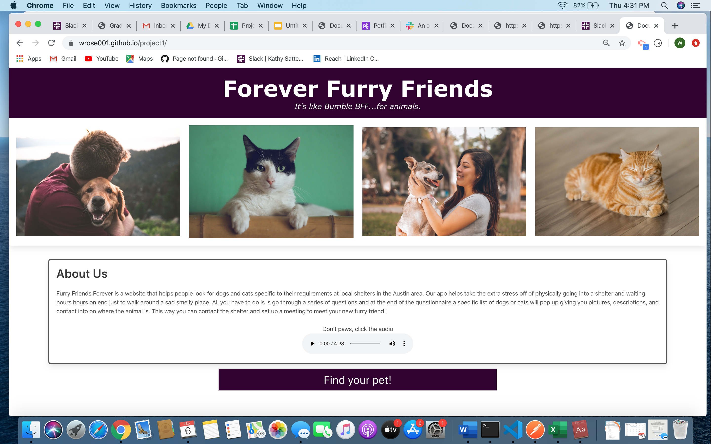

# Forever Furry Friends (Project 1)
This web application is intented to increase efficiencies and reduce wait time for potential new pet owners hoping to adopt. Our app allows users to answer a series of questions, which then displays with the help of the PetFinder API a list of of pets with images, descriptions and contact info. Additionally, we provide a joke API a the end of the app.

### Included Files

* index.html
* style.css
* script.js
* README.md
* images
* audio

## Deployment

[https://wrose001.github.io/project1/](https://wrose001.github.io/project1/)

## Images

 

## Built With

This pet adoption application was built with the PetFinder API, as well as Joke API. Additionally, we included audio in our file.

## Contributing

Pull requests are welcome. For major changes, please open an issue first to discuss what you would like to change.

Please make sure to update tests as appropriate.

# Acknowledgments

Many thanks to my project partners Pranitha Maganty and Tabby Garcia for being incredible team members. We all met frequently and worked collaboratively to develop and code this application.

# Forever Furry Friends (Project 1)